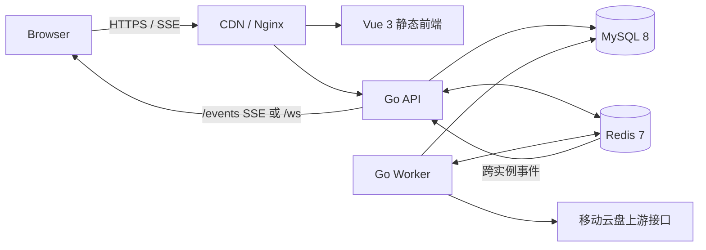

# 移动云盘自动任务与兑换管理系统

[](./backend/go.mod)
[](./frontend/package.json)
[](./docker-compose.yml)
[](./docker-compose.yml)
[](./LICENSE)

面向移动云盘账号运营的全栈自动化平台：集中管理账号与兑换规则，执行日常任务、商品同步和定时兑换，并提供可审计的任务结果、监控与实时推送。

> 生产环境使用一个后端制品 `caiyun-linux`，分别以 `api`、`worker` 与 `migrate` 角色运行；不要把 API、Worker 和数据库迁移混在一个不可控的进程中。

## 目录

- [能力概览](#能力概览)
- [架构与运行模型](#架构与运行模型)
- [快速开始](#快速开始)
- [配置](#配置)
- [实时推送：SSE 优先](#实时推送sse-优先)
- [构建、测试与发布](#构建测试与发布)
- [运维](#运维)
- [项目结构](#项目结构)
- [安全与贡献](#安全与贡献)

## 能力概览

| 范畴 | 能力 |
| --- | --- |
| 身份与会话 | 注册、登录、Cookie/JWT 会话、刷新令牌、邮箱找回、会话版本失效 |
| 账号管理 | 多账号托管、Token 刷新、健康检查、失效隔离与状态审计 |
| 自动任务 | 签到、奖励领取、任务中心巡检、云朵统计等可注册、可调度任务 |
| 兑换中心 | 商品同步、兑换规则、多账号定时兑换、失败重试、月度同系列保护、结果记录 |
| 异步执行 | Redis Streams/List 队列、Worker 并发控制、操作 Outbox、死信与幂等处理 |
| 实时反馈 | SSE（CDN 默认）/WebSocket（保留）消息推送、断线重连、消息序列与离线补偿 |
| 可观测性 | JSON 日志、请求 ID、健康探针、Worker 指标、Prometheus/Grafana 配置 |
| 运行保障 | 版本化 SQL 迁移、字段加密轮换、Docker Compose、systemd、Kubernetes、回滚脚本 |

## 架构与运行模型



- **API**：HTTP 接口、认证、账号/任务/兑换管理、SSE/WS 连接与事件投递。
- **Worker**：消费任务队列，执行自动任务与抢兑，持久化结果并发布通知。
- **Redis**：队列、分布式锁、限流与跨实例推送事件总线。
- **MySQL**：业务数据、任务状态、兑换记录、操作 Outbox 与迁移版本。
- **Nginx/CDN**：静态资源、反向代理与 SSE 长连接透传。

## 快速开始

### 前置条件

- Go `1.25+`
- Node.js `20+` 与 npm
- MySQL `8.0+`
- Redis `7.0+`
- Docker Compose（推荐本地一键运行）

### Docker Compose

```bash
cp .env.example .env
# 编辑 .env：至少替换所有密码、JWT_SECRET、DATA_ENCRYPTION_KEYS、WORKER_MONITOR_TOKEN

docker compose up --build -d
docker compose ps
```

服务默认入口：

- 前端：`http://localhost`
- API 健康检查：`http://localhost/readyz`
- Worker 健康检查：`http://127.0.0.1:8081/readyz`

Compose 会先运行 `backend-migrate`；只有迁移成功后 API 和 Worker 才会启动。

### 本地源码运行

```bash
# 终端 1：准备基础设施与环境变量后，执行迁移
cd backend
go run ./cmd/caiyun migrate

# 终端 2：API
go run ./cmd/caiyun api

# 终端 3：Worker
go run ./cmd/caiyun worker

# 终端 4：前端
cd ../frontend
cp .env.example .env.local
npm ci
npm run dev
```

## 配置

### 后端

根目录 [`.env.example`](./.env.example) 是 Docker Compose/后端配置模板。生产环境至少配置：

```dotenv
APP_ENV=production
DB_AUTO_MIGRATE=false
MYSQL_PASSWORD=<强密码>
REDIS_PASSWORD=<强密码>
JWT_SECRET=<至少 32 字符的随机值>
DATA_ENCRYPTION_KEYS=v1=<32-byte-key>
DATA_ENCRYPTION_CURRENT_VERSION=v1
WORKER_MONITOR_TOKEN=<随机值>
TRUSTED_PROXIES=<真实反代 IP 或 CIDR；直连时为 none>
```

`DATA_ENCRYPTION_KEYS`、JWT、数据库密码和 Redis 密码属于敏感配置，只通过部署平台的 Secret/环境变量注入，不能提交到仓库。

### 前端

前端模板在 [`frontend/.env.example`](./frontend/.env.example)。Vite 的 `VITE_*` 变量在**构建阶段**写入产物，修改后必须重新执行 `npm run build`。

```dotenv
VITE_API_BASE_URL=
VITE_PUSH_TRANSPORT=sse
VITE_SSE_URL=/events
# 仅在直连或支持 WS 的边缘网络中配置：
# VITE_WS_URL=/ws
```

## 实时推送：SSE 优先

项目同时保留 `/ws` 和新增的 `/events`：

| 模式 | 配置 | 适用场景 |
| --- | --- | --- |
| SSE（默认） | `VITE_PUSH_TRANSPORT=sse` | 当前 CDN 不透传 WebSocket Upgrade 的生产域名 |
| WebSocket | `VITE_PUSH_TRANSPORT=ws` | 直连源站或确认支持 WS/WSS 的网络 |
| 自动降级 | `VITE_PUSH_TRANSPORT=auto` | 同一前端包同时服务 CDN 与直连环境；先试 WS，失败后切 SSE |

生产 CDN 已确定不支持 WS/WSS 时应显式使用 `sse`，不要使用 `auto`：自动模式会产生一次 `/ws` Upgrade 失败和额外连接延迟。

SSE 端点使用同源 Cookie 会话、`Last-Event-ID` 重放、3 秒心跳（`SSE_HEARTBEAT_INTERVAL` 可调）以及 Nginx 禁缓冲策略。完整的 CDN、Nginx 与验证步骤见 [`deploy/CDN_SSE.md`](./deploy/CDN_SSE.md)。

## 构建、测试与发布

### 质量检查

```bash
# 后端全量测试
cd backend && go test ./...

# 前端类型检查、单测与构建
cd frontend
npm run typecheck
npm run test:unit
npm run build
```

### Linux amd64 后端制品

```bash
make backend-build
# 输出：backend/caiyun-linux 与 backend/SHA256SUMS
```

统一二进制命令：

```bash
./caiyun-linux api
./caiyun-linux worker
./caiyun-linux migrate
./caiyun-linux migrate --validate-only
./caiyun-linux reencrypt --table all --batch-size 200 --apply
./caiyun-linux version
```

### 推荐发布顺序

1. 备份数据库与当前制品。
2. 替换 `caiyun-linux`，先运行 `caiyun-linux migrate`。
3. 通过 `caiyun-linux migrate --validate-only` 校验结构。
4. 同版本重启 **API 和 Worker**。
5. 用 `VITE_PUSH_TRANSPORT=sse` 构建并发布 `frontend/dist`。
6. 发布 Nginx `/events` 配置，执行 `nginx -t && systemctl reload nginx`。
7. 检查 `/readyz`、Worker `/readyz` 和浏览器 `/events` 长连接。

裸机/systemd、Kubernetes、回滚与发布包说明见 [`deploy/README.md`](./deploy/README.md)。

## 运维

### 健康检查

| 端点 | 含义 |
| --- | --- |
| `/livez` | 进程存活 |
| `/readyz` | MySQL、Redis、队列等依赖已就绪 |
| `/startupz` | 应用初始化完成 |

```bash
bash scripts/health-check.sh
PUBLIC_URL=https://example.com/readyz bash scripts/health-check.sh
```

### 常用排查

```bash
# 迁移及结构检查
./caiyun-linux migrate --validate-only

# SSE 验证：应立即返回 retry，并持续收到 : ping
curl -N --http1.1 -H 'Cookie: auth_token=<token>' https://example.com/events

# Compose 日志
docker compose logs -f backend-api backend-worker
```

若日志出现 `GET /ws status=400` 且 `Upgrade header` 缺失，说明已部署的旧前端仍在使用 WebSocket，或前端构建时未设置 `VITE_PUSH_TRANSPORT=sse`；这不是 Worker 队列错误。

## 项目结构

```text
.
├── backend/
│   ├── cmd/caiyun/             # api / worker / migrate / reencrypt 单一入口
│   ├── internal/               # 领域服务、队列、仓储、认证、推送
│   ├── migrations/             # 版本化 SQL 迁移
│   └── configs/                # Grafana 与运行配置
├── frontend/
│   ├── src/                    # Vue 页面、组件、API 客户端
│   └── nginx.conf              # 容器前端反向代理
├── deploy/                     # systemd、CDN、监控和发布说明
├── k8s/                        # Kubernetes 清单
├── scripts/                    # 发布、回滚、健康检查、归档工具
├── docker-compose.yml
└── Makefile
```

## 安全与贡献

- 不提交 `.env`、Cookie、Token、账号信息、日志导出或真实生产数据。
- PR 应包含最小必要改动、测试结果及迁移/回滚说明；涉及 SQL 时同步更新 `backend/migrations/` 与 `backend/internal/dbmigrate/sql/`。
- 生产发布前执行后端测试、前端类型检查/单测/构建，并验证迁移与健康探针。
- 许可证见 [`LICENSE`](./LICENSE)。
