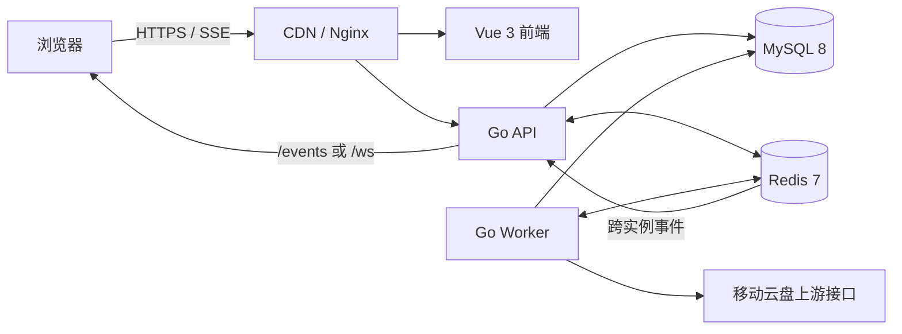

# 移动云盘管理系统

[](./backend/go.mod)
[](./frontend/package.json)
[](./docker-compose.yml)
[](./docker-compose.yml)
[](./LICENSE)

面向移动云盘账号运营场景的全栈自动化平台。系统提供账号托管、日常任务执行、商品同步、定时兑换、结果审计和实时状态推送，并具备队列调度、数据迁移、健康检查及多种部署能力。

生产环境采用统一后端制品 `caiyun-linux`。API、Worker 和数据库迁移通过独立子命令运行，并作为不同进程部署，以确保职责隔离和发布过程可控。

## 目录

- [核心能力](#核心能力)
- [系统架构](#系统架构)
- [技术栈](#技术栈)
- [快速开始](#快速开始)
- [配置管理](#配置管理)
- [开发与质量验证](#开发与质量验证)
- [构建与发布](#构建与发布)
- [可观测性与运维](#可观测性与运维)
- [项目结构](#项目结构)
- [相关文档](#相关文档)
- [安全与贡献](#安全与贡献)

## 核心能力

| 领域 | 说明 |
| --- | --- |
| 身份与会话 | 注册、登录、Cookie/JWT 会话、刷新令牌、邮箱找回和会话版本失效 |
| 账号管理 | 多账号托管、Token 刷新、健康检查、异常隔离和状态审计 |
| 自动任务 | 签到、奖励领取、任务中心巡检、云朵统计等可注册任务 |
| 兑换中心 | 商品同步、规则配置、多账号定时兑换、失败重试和兑换结果记录 |
| 异步处理 | Redis Streams/List 队列、并发控制、分布式锁、Outbox、幂等和死信处理 |
| 实时推送 | SSE 优先，保留 WebSocket；支持重连、消息序列和离线补偿 |
| 数据治理 | 版本化 SQL 迁移、敏感字段加密和密钥轮换 |
| 运行保障 | 健康探针、结构化日志、指标监控、回滚脚本和制品校验 |

## 系统架构



| 运行单元 | 主要职责 |
| --- | --- |
| API | HTTP 接口、认证授权、业务管理、SSE/WebSocket 连接和事件投递 |
| Worker | 队列消费、自动任务、兑换执行、结果持久化和通知发布 |
| MySQL | 业务数据、任务状态、兑换记录、Outbox 和迁移版本 |
| Redis | 队列、缓存、分布式锁、限流和跨实例事件总线 |
| Nginx/CDN | 静态资源分发、反向代理和 SSE 长连接透传 |

## 技术栈

| 层级 | 组件 |
| --- | --- |
| 后端 | Go 1.25.12、Gin、GORM |
| 前端 | Vue 3、TypeScript、Vite |
| 数据 | MySQL 8、Redis 7 |
| 测试 | Go testing、Vitest、Playwright |
| 运维 | Docker Compose、Kubernetes、systemd、Nginx、Prometheus、Grafana |

## 快速开始

### 环境要求

- Go `1.25.12`
- Node.js `20+` 与 npm
- MySQL `8.0+`
- Redis `7.0+`
- Docker Compose（推荐）

### 使用 Docker Compose

```bash
cp .env.example .env
# 设置数据库、Redis、JWT、数据加密和 Worker 监控相关密钥
docker compose up --build -d
docker compose ps
```

默认访问地址：

| 服务 | 地址 |
| --- | --- |
| Web 前端 | `http://localhost` |
| API 就绪探针 | `http://localhost/readyz` |
| Worker 就绪探针 | `http://127.0.0.1:8081/readyz` |

Compose 首先执行 `backend-migrate`。迁移成功后，`backend-api` 和 `backend-worker` 才会进入启动阶段。

### 本地源码运行

准备可用的 MySQL、Redis 和后端环境变量，然后分别启动各运行单元：

```bash
# 数据库迁移
cd backend
go run ./cmd/caiyun migrate

# API
cd backend
go run ./cmd/caiyun api

# Worker
cd backend
go run ./cmd/caiyun worker

# 前端开发服务器
cd frontend
cp .env.example .env.local
npm ci
npm run dev
```

## 配置管理

### 后端配置

根目录 [`.env.example`](./.env.example) 是 Compose 和后端配置模板。生产环境至少应配置：

```dotenv
APP_ENV=production
DB_AUTO_MIGRATE=false
MYSQL_PASSWORD=<strong-password>
REDIS_PASSWORD=<strong-password>
JWT_SECRET=<random-value-at-least-32-characters>
DATA_ENCRYPTION_KEYS=v1=<32-byte-key>
DATA_ENCRYPTION_CURRENT_VERSION=v1
WORKER_MONITOR_TOKEN=<random-value>
TRUSTED_PROXIES=<proxy-ip-or-cidr>
```

敏感值应通过部署平台的 Secret 或环境变量注入。生产环境应显式关闭自动迁移，并在发布阶段单独执行 `caiyun-linux migrate`。

### 前端配置

前端配置模板位于 [`frontend/.env.example`](./frontend/.env.example)。所有 `VITE_*` 变量均在构建阶段写入静态产物，配置变更后需要重新构建。

```dotenv
VITE_API_BASE_URL=
VITE_PUSH_TRANSPORT=sse
VITE_SSE_URL=/events
# VITE_WS_URL=/ws
```

| 推送模式 | 配置值 | 使用场景 |
| --- | --- | --- |
| SSE | `sse` | 默认生产配置，适用于不支持 WebSocket Upgrade 的 CDN |
| WebSocket | `ws` | 直连源站或已确认支持 WS/WSS 的网络 |
| 自动选择 | `auto` | 同一前端产物需要兼容多种网络环境 |

SSE 支持同源 Cookie 会话、`Last-Event-ID` 重放、可配置心跳和 Nginx 禁缓冲。部署要求与验证方法参见 [`deploy/CDN_SSE.md`](./deploy/CDN_SSE.md)。

## 开发与质量验证

依赖安装应使用锁文件：前端执行 `npm ci`，后端保持 `go.mod` 与 `go.sum` 同步。

| 命令 | 作用 |
| --- | --- |
| `make test` | 执行后端单元测试和前端 Vitest 测试 |
| `make vet` | 执行 Go 静态检查 |
| `make redis-integration` | 执行 Redis 队列集成测试 |
| `make frontend-e2e` | 执行 Playwright 端到端测试 |
| `make openapi-check` | 生成并校验本地 OpenAPI 路由清单 |
| `cd frontend && npm run typecheck` | 校验 Vue/TypeScript 类型 |
| `cd frontend && npm run lint` | 执行 ESLint |
| `cd frontend && npm run bundle:budget` | 校验前端产物体积预算 |

后端测试文件与实现代码同目录，命名为 `*_test.go`；前端单元测试命名为 `*.test.ts`，端到端测试命名为 `*.spec.ts`。CI 还会执行 Go race detector、MySQL/Redis 集成测试、漏洞扫描、构建验证和部署脚本检查。

## 构建与发布

### 构建制品

```bash
make build
```

主要输出：

- `backend/caiyun-linux`
- `backend/SHA256SUMS`
- `frontend/dist/`

统一后端制品支持以下命令：

```bash
./caiyun-linux api
./caiyun-linux worker
./caiyun-linux migrate
./caiyun-linux migrate --validate-only
./caiyun-linux reencrypt --table all --batch-size 200 --apply
./caiyun-linux version
```

### 发布顺序

1. 备份数据库和当前运行制品。
2. 部署新版本 `caiyun-linux`。
3. 执行 `caiyun-linux migrate` 和 `migrate --validate-only`。
4. 使用同一版本分别重启 API 与 Worker。
5. 构建并发布 `frontend/dist/`。
6. 验证 Nginx 配置并重新加载服务。
7. 检查健康探针、Worker 指标和 `/events` 长连接。

systemd、Kubernetes、制品打包和回滚流程参见 [`deploy/README.md`](./deploy/README.md)。

## 可观测性与运维

### 健康探针

| 端点 | 语义 |
| --- | --- |
| `/livez` | 进程存活状态 |
| `/readyz` | MySQL、Redis、队列等依赖就绪状态 |
| `/startupz` | 应用初始化状态 |

```bash
bash scripts/health-check.sh
PUBLIC_URL=https://example.com/readyz bash scripts/health-check.sh
```

### 常用诊断

```bash
# 校验数据库结构
./caiyun-linux migrate --validate-only

# 验证 SSE 连接
curl -N --http1.1 \
  -H 'Cookie: auth_token=<token>' \
  https://example.com/events

# 查看 Compose 服务日志
docker compose logs -f backend-api backend-worker
```

Prometheus 告警规则和 Grafana 仪表盘位于 `deploy/monitoring/`。应用日志采用结构化输出，并通过请求 ID 关联 API 请求、队列任务和后台执行结果。

## 项目结构

```text
.
├── backend/
│   ├── cmd/caiyun/              # 统一后端入口
│   ├── internal/                # 业务、仓储、队列、认证和监控实现
│   ├── migrations/              # 版本化 SQL 迁移
│   ├── docs/                    # 后端运维与迁移文档
│   └── configs/                 # 运行和监控配置
├── frontend/
│   ├── src/                     # Vue 应用源码
│   ├── e2e/                     # Playwright 测试
│   └── public/                  # 静态资源
├── deploy/                      # systemd、CDN 和监控配置
├── k8s/                         # Kubernetes 清单
├── scripts/                     # 构建、发布、回滚和验证脚本
├── docker-compose.yml           # 本地及单机部署编排
└── Makefile                     # 统一工程命令
```

## 相关文档

### 部署与运维

- [`deploy/README.md`](./deploy/README.md)：部署方式选择与生产配置基线
- [`deploy/DOCKER_COMPOSE.md`](./deploy/DOCKER_COMPOSE.md)：Docker Compose 整套部署
- [`deploy/DOCKER_STANDALONE.md`](./deploy/DOCKER_STANDALONE.md)：独立 Docker 容器部署
- [`deploy/SINGLE_HOST.md`](./deploy/SINGLE_HOST.md)：Linux 单机与 systemd 部署
- [`deploy/SOURCE_DEPLOYMENT.md`](./deploy/SOURCE_DEPLOYMENT.md)：源码开发与构建部署
- [`deploy/KUBERNETES.md`](./deploy/KUBERNETES.md)：Kubernetes 集群部署
- [`deploy/NGINX_TLS.md`](./deploy/NGINX_TLS.md)：Nginx、HTTPS、SSE 与 WebSocket
- [`deploy/UPGRADE_ROLLBACK.md`](./deploy/UPGRADE_ROLLBACK.md)：版本升级、发布验证与回滚
- [`deploy/BACKUP_RESTORE.md`](./deploy/BACKUP_RESTORE.md)：MySQL、Redis、配置备份与灾难恢复
- [`deploy/TROUBLESHOOTING.md`](./deploy/TROUBLESHOOTING.md)：生产故障定位与处理
- [`deploy/monitoring/README.md`](./deploy/monitoring/README.md)：Prometheus、Grafana 与告警接入
- [`deploy/CDN_SSE.md`](./deploy/CDN_SSE.md)：SSE/CDN 配置与验证
- [`deploy/BAIDU_CDN_WEBSOCKET.md`](./deploy/BAIDU_CDN_WEBSOCKET.md)：WebSocket/CDN 配置

### 后端专项

- [`backend/docs/OPERATIONS_CHECKLIST.md`](./backend/docs/OPERATIONS_CHECKLIST.md)：生产运维检查表
- [`backend/docs/ENCRYPTION_ROTATION.md`](./backend/docs/ENCRYPTION_ROTATION.md)：敏感字段密钥轮换
- [`backend/docs/REDIS_STREAMS_QUEUE_MIGRATION.md`](./backend/docs/REDIS_STREAMS_QUEUE_MIGRATION.md)：队列迁移说明

## 安全与贡献

- 仓库中不得提交 `.env`、Cookie、Token、账号信息、生产日志或真实业务数据。
- SQL 变更应同步维护 `backend/migrations/` 和 `backend/internal/dbmigrate/sql/`。
- 功能变更应附带相应测试，并通过后端测试、前端类型检查、单元测试和构建验证。
- 发布相关变更应说明数据库迁移、配置兼容性和回滚方案。
- 提交应保持变更范围清晰，并在说明中列出验证命令；项目许可证参见 [`LICENSE`](./LICENSE)。
