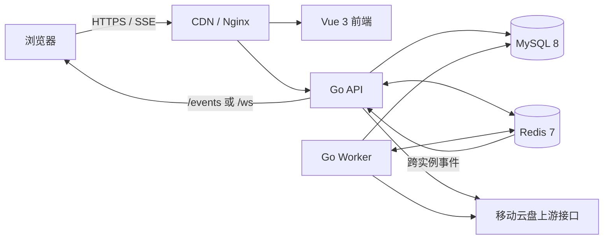

# 移动云盘管理系统

[](./backend/go.mod)
[](./frontend/package.json)
[](./docker-compose.yml)
[](./docker-compose.yml)
[](./LICENSE)

面向移动云盘账号运营场景的全栈自动化平台。系统提供多账号托管、活动任务执行、账号邮件互发与互助、商品同步、定时抢兑、待领奖品展示、云朵趋势和实时状态推送，并具备队列调度、数据迁移、健康检查及多种部署能力。

生产环境采用统一后端制品 `caiyun-linux`。API、Worker 和数据库迁移通过独立子命令运行，并作为不同进程部署，以确保职责隔离和发布过程可控。

本文功能、配置与构建说明已于 **2026-09-30** 对照仓库实现更新。已有账号的旧版加密凭据可选择兼容读取，具体设置见[旧版凭据兼容](#旧版凭据兼容)。

## 目录

- [核心能力](#核心能力)
  - [活动任务与多账号](#活动任务与多账号)
- [系统架构](#系统架构)
- [技术栈](#技术栈)
- [一键部署](#一键部署)
- [快速开始](#快速开始)
  - [Android Termux 部署（免 Docker、免 root）](#android-termux-部署免-docker免-root)
- [配置管理](#配置管理)
  - [旧版凭据兼容](#旧版凭据兼容)
- [开发与质量验证](#开发与质量验证)
- [构建与发布](#构建与发布)
- [可观测性与运维](#可观测性与运维)
- [项目结构](#项目结构)
- [相关文档](#相关文档)
- [安全与贡献](#安全与贡献)

## 核心能力

| 领域 | 说明 |
| --- | --- |
| 身份与会话 | 注册、登录、Cookie/JWT 会话、刷新令牌、邮箱找回和会话版本失效 |
| 账号管理 | 多账号托管、到期自动刷新 Token、连续刷新失败后的暂停、更新凭据及手动恢复 |
| 自动任务 | 签到、任务中心、AI 活动、备份奖励、139 邮箱互发和活动互助；按账号隔离配置 |
| 兑换中心 | 商品同步、规则配置、多账号抢兑、单点/多时段/Cron 调度、日历策略与失败重试 |
| 领奖专区 | 按账号展示全部待领奖品，支持搜索、到期筛选、分页、刷新和领取指引 |
| 云朵统计 | 当前余额、今日任务收益、全局排名和历史趋势；缺失或覆盖不全的数据保留断点 |
| 异步处理 | Redis Streams/List 队列、并发控制、分布式锁、Outbox、幂等和死信处理 |
| 实时推送 | SSE 优先，保留 WebSocket；支持重连、消息序列和离线补偿 |
| 数据治理 | 版本化 SQL 迁移、敏感字段加密和密钥轮换 |
| 运行保障 | 健康探针、结构化日志、指标监控、回滚脚本和制品校验 |

### 活动任务与多账号

可在管理页面配置任务，按账号执行或由 Worker 批量调度。主要任务组如下，完整覆盖范围和上游条件见[任务覆盖文档](./backend/docs/TASK_COVERAGE.md)。

| 任务组 | 主要能力 |
| --- | --- |
| 日常任务 | 每日签到、微信签到/抽奖、备份及云朵翻倍、任务中心巡检、消息奖励和云朵统计 |
| AI 与活动任务 | 算力大作战、许愿活动、趣玩 AI、校园海报、AI 图像/扫描/写真及限时任务 |
| 多账号协作 | `mail_mutual`：139 邮箱账号互发；`mutual_assist`：许愿、算力和趣玩 AI 活动互助 |
| 奖励与权益 | `prize_center`、`hidden_rewards`、`upgrade_gift`、`student_perks`、`mcloud_day` |
| 扩展活动 | `fun_ai_mail`、`family_circle`、`meitu_backup`、`red_invite`、`unloading_1t`、`rafflecode`、`ai_store` |
| 设备状态 | `notice_switch`、`album_backup_report`：按账号配置真实通知与备份状态 |

- 邮件互发和活动互助仅在**同一网站用户名下的活跃云盘账号**之间执行，至少需要两个账号。
- 邮件按有向账号对去重：A 发给 B 与 B 发给 A 分别计算，每对每自然月最多一次。单次执行最多发信 `CAIYUN_MAIL_MUTUAL_MAX_SENDS_PER_RUN` 封，默认 20；账号较多时由后续批次继续处理。
- 139 邮箱互发使用云盘账号对应的邮箱授权。网站密码找回邮件使用单独的 SMTP 配置。
- 云盘凭据到期时优先刷新；单纯到期不会停用账号。连续 3 次刷新/获取 JWT 失败后暂停，更新凭据或手动启用可重置错误计数。
- 任务完成以服务端状态为准；短信验证码、学生资格、设备真实状态、库存和活动开放条件会影响可执行范围。AI 豆兑换等默认关闭的操作需要主动启用或单独执行。

领奖专区位于「兑换中心 → 领奖专区」。普通用户查询自己的账号，管理员可选择托管账号；查询接口为 `GET /api/v1/exchange/prizes?account_id=账号ID`，附加 `refresh=1` 可强制刷新。

云朵奖励按 `infoV3.receiveList` 的实际 `recordId` 逐项通过 `receiveV3` 领取，并复查记录与余额；日志统计实际到账。抢兑使用 `exchangeV3` 的 POST/JSON 请求及设备标识。抓包对照、验证与边界见 [V3 领取和兑换报告](./backend/docs/2026-09-30_protocol-云盘领取与抢兑-report.md)。

日常批次先执行活动，再领取新增云朵、更新统计和清理资源；重复批次跳过当天已成功的动作，继续未完成项。多账号批量操作有并发上限，同账号保持任务顺序；抢兑提前准备设备与会话。性能和失败状态说明见 [任务流程优化](./backend/docs/TASK_EXECUTION_PERFORMANCE.md)。

抢兑统一提前 **1 分钟**预热：10:00 场次从 09:59:00 开始，16:00 从 15:59:00 开始，自定义时间和 Cron 场次同样适用。预热期间每 15 秒补查新增任务，Worker 在预热窗口内重启会立即补热；到点按日期、场次和任务 ID 去重派发，避免精确定时器与兜底重复执行。

首页「今日获得」统计任务收益，云朵趋势统计余额净变化；兑换支出会影响余额。历史缺失或账号覆盖不全时显示断点，新增账号的初始余额不会当作任务收益。

## 系统架构


```mermaid
flowchart LR
  Browser[浏览器] -->|HTTPS / SSE| Edge[CDN / Nginx]
  Edge --> Frontend[Vue 3 前端]
  Edge --> API[Go API]
  API --> MySQL[(MySQL 8)]
  API <--> Redis[(Redis 7)]
  API --> Upstream
  Worker[Go Worker] <--> Redis
  Worker --> MySQL
  Worker --> Upstream[移动云盘上游接口]
  Redis -->|跨实例事件| API
  API -->|/events 或 /ws| Browser
```

| 运行单元 | 主要职责 |
| --- | --- |
| API | HTTP 接口、认证授权、业务管理、SSE/WebSocket 连接和事件投递 |
| Worker | 队列消费、自动任务、兑换执行、结果持久化和通知发布 |
| MySQL | 业务数据、任务状态、兑换记录、Outbox 和迁移版本 |
| Redis | 队列、缓存、分布式锁、限流和跨实例事件总线 |
| Nginx/CDN | 静态资源分发、反向代理和 SSE 长连接透传 |

## 技术栈

| 层级 | 组件 |
| --- | --- |
| 后端 | Go 1.25.13、Gin、GORM |
| 前端 | Vue 3、TypeScript、Vite |
| 数据 | MySQL 8、Redis 7 |
| 测试 | Go testing、Vitest、Playwright |
| 运维 | Docker Compose、Kubernetes、systemd、Nginx、Prometheus、Grafana |

## 一键部署

在仓库根目录执行以下命令，即可自动完成配置生成、镜像构建、数据库迁移、管理员初始化、服务启动和健康检查：

```bash
bash scripts/deploy-compose.sh --local
```

生产环境需要配置 HTTPS 域名：

```bash
PUBLIC_ORIGIN=https://cloud.example.com bash scripts/deploy-compose.sh --production
```

如果已经准备好有效的 `.env`，后续启动或更新也可以直接使用更短的纯 Compose 命令：

```bash
docker compose up --build -d
```

该命令会按照 Compose 依赖顺序执行数据库迁移和管理员初始化；全新环境首次部署仍建议使用上面的部署脚本，以自动生成安全配置并完成健康检查。

## 快速开始

### 环境要求

- Docker Engine 与 Docker Compose v2（Docker 部署）
- Go `1.25.13` 或更高版本（后端源码开发）
- Node.js `20.19+（20.x）` 或 `22.12+` 与 npm（前端源码开发，需满足 Vite 的 engines 要求）
- 可通过 `python` 命令调用的 Python 3（用于生成本地接口契约）
- MySQL `8.0+`、Redis `7.0+`（仅源码开发或外部依赖部署）

### 使用 Docker Compose

```bash
bash scripts/deploy-compose.sh
```

Windows PowerShell：

```powershell
.\scripts\deploy-compose.ps1
```

默认访问地址：

| 服务 | 地址 |
| --- | --- |
| Web 前端 | 脚本输出的 `CAIYUN_HTTP_PORT` 地址 |
| API 就绪探针 | 脚本输出的 `CAIYUN_API_PORT/readyz` 地址 |
| Worker 就绪探针 | 脚本输出的 `CAIYUN_WORKER_PORT/readyz` 地址 |

部署脚本会在首次运行时生成 `.env`、构建镜像、等待 MySQL/Redis 就绪、执行 `backend-migrate`、幂等创建初始管理员、启动 API/Worker/前端并执行健康检查。脚本不会覆盖已有 `.env`，也不会删除数据卷。

生产环境需要先准备 HTTPS 反向代理，并使用：

```bash
PUBLIC_ORIGIN=https://cloud.example.com bash scripts/deploy-compose.sh --production
```

如果只需要本地 HTTP 演示，可以显式使用：

```bash
bash scripts/deploy-compose.sh --local
```

### 本地源码运行

准备可用的 MySQL、Redis 和后端环境变量。以下命令从仓库根目录执行：先执行迁移，再在不同终端启动 API、Worker 和前端。

```bash
# 数据库迁移
(cd backend && go run ./cmd/caiyun migrate)

# API
(cd backend && go run ./cmd/caiyun api)

# Worker
(cd backend && go run ./cmd/caiyun worker)

# 前端开发服务器
cd frontend
cp .env.example .env.local
npm ci
npm run dev
```

### Android Termux 部署（免 Docker、免 root）

在没有 Docker 的 Android 手机上（如旧机型、vivo/小米等限制 Docker 的 ROM），可以用 [Termux](https://termux.dev/) 原生部署全栈。与 Docker 部署的差异点：

- **Go 二进制必须 CGO 编译**：Android 没有 `/etc/resolv.conf`，`CGO_ENABLED=0` 的纯静态二进制内置 DNS 解析器会回退查询 `127.0.0.1:53`（无监听）导致所有域名解析失败，表现为任务批量报 `upstream circuit is open`。正确做法是在 Termux 本机编译：

  ```bash
  pkg install -y golang clang git
  git clone https://github.com/<your>/caiyun && cd caiyun/backend
  CGO_ENABLED=1 GOOS=android GOARCH=arm64 CC=clang \
    go build -trimpath -ldflags="-s -w" -o caiyun-linux ./cmd/caiyun
  ```

- **前端在 PC 构建**：Termux 中 rollup 原生模块因 bionic libc 不兼容会失败，`npm run build` 后把 `dist/` 打包上传到手机 `~/caiyun/dist`。
- **数据库用 MariaDB**（Termux 官方包，兼容 MySQL 协议），Redis/nginx 均有原生包。

部署步骤（全部脚本位于 [`deploy/termux/`](./deploy/termux)）：

```bash
# 1. 安装依赖
bash deploy/termux/install_deps.sh

# 2. 初始化 Redis + MariaDB（随机生成全部密钥到 ~/caiyun/secrets.env，勿提交）
bash deploy/termux/deploy_infra.sh

# 3. 生成 .env、执行迁移、启动 API(:8080) 与 Worker(:8081)
#    二进制放 ~/caiyun/caiyun-arm64.new；经 nginx 访问时先 export CAIYUN_ORIGIN=http://<手机IP>:5701
bash deploy/termux/deploy_app.sh

# 4. nginx 静态托管 + 反代，监听 :5701
bash deploy/termux/deploy_nginx.sh

# 5. 注册管理员（密码 ≥8 位含字母数字）
CAIYUN_ADMIN_USER=admin CAIYUN_ADMIN_PASS='yourpass' bash deploy/termux/create_admin.sh
```

**开机自启**：安装 Termux:Boot 后执行（脚本头部注释含国产 ROM 白名单注意事项）：

```bash
mkdir -p ~/.termux/boot
echo 'bash $HOME/caiyun/start_all.sh >> $HOME/caiyun/logs/boot.log 2>&1' \
  > ~/.termux/boot/00-caiyun.sh && chmod +x ~/.termux/boot/00-caiyun.sh
```

日常恢复/重启全部服务：`bash ~/caiyun/start_all.sh`（幂等）。

## 配置管理

### 后端配置

根目录 [`.env.example`](./.env.example) 是 Compose 和后端配置模板。生产环境至少应配置：

```dotenv
APP_ENV=production
DB_AUTO_MIGRATE=false
MYSQL_PASSWORD=<strong-password>
REDIS_PASSWORD=<strong-password>
JWT_SECRET=<random-value-at-least-32-characters>
DATA_ENCRYPTION_KEYS=v1=<32-byte-key>
DATA_ENCRYPTION_CURRENT_VERSION=v1
WORKER_MONITOR_TOKEN=<random-value>
TRUSTED_PROXIES=<proxy-ip-or-cidr>
```

敏感值应通过部署平台的 Secret 或环境变量注入。生产环境应显式关闭自动迁移，并在发布阶段单独执行 `caiyun-linux migrate`。

日常任务与账号协作的常用配置：

| 配置 | 默认值 | 作用 |
| --- | --- | --- |
| `TASK_SCHEDULE` | `0 8 * * *` | Worker 每日批次的 Cron 时间 |
| `TASK_CONCURRENCY` | 以部署模板为准 | 同时执行的账号任务数量 |
| `CAIYUN_MAIL_MUTUAL_MAX_SENDS_PER_RUN` | `20` | 单次邮箱互发任务的最大发信数 |
| `FIELD_CRYPTO_ALLOW_LEGACY_NO_AAD` | `false` | 是否读取历史无 AAD 的加密凭据 |

活动验证码、奖品 OID 和设备状态按账号配置，配置键追加 `_手机号`，具体键名和前置条件见[实现核对说明](./backend/docs/IMPLEMENTATION_RECHECK.md)。Docker 部署需将这些配置显式传入 Worker 的 `environment` 或 `env_file`。

### 旧版凭据兼容

数据库中的 `auth/token/jwt_token` 使用 AES-GCM 加密。新格式包含 AAD 校验上下文；历史无 AAD 密文可以选择继续兼容读取：

```dotenv
FIELD_CRYPTO_ALLOW_LEGACY_NO_AAD=true
```

API 和 Worker 使用相同配置，修改后重启两个进程。**保留历史密文对应的原始密钥与版本**；开启兼容后支持读取新旧密文，新写入凭据仍使用新格式，此模式无需执行 `reencrypt`。

也可以备份数据库后将旧数据转换为新格式。在加载现有数据库和加密配置的目录执行：

```bash
# 只读扫描，确认历史数据可解密
./caiyun-linux reencrypt

# 扫描成功、数据库备份完成后执行
./caiyun-linux reencrypt --apply
```

迁移完成后可将兼容开关设为 `false` 并重启 API、Worker。密钥不匹配或密文损坏时，开启兼容也无法恢复凭据；领奖接口会返回 409 和具体处理提示。完整排查步骤见[部署凭据修复说明](./backend/docs/DEPLOYMENT_CREDENTIAL_HOTFIX.md)。

### 前端配置

前端配置模板位于 [`frontend/.env.example`](./frontend/.env.example)。所有 `VITE_*` 变量均在构建阶段写入静态产物，配置变更后需要重新构建。

```dotenv
VITE_API_BASE_URL=
VITE_PUSH_TRANSPORT=sse
VITE_SSE_URL=/events
# VITE_WS_URL=/ws
```

| 推送模式 | 配置值 | 使用场景 |
| --- | --- | --- |
| SSE | `sse` | 默认生产配置，适用于不支持 WebSocket Upgrade 的 CDN |
| WebSocket | `ws` | 直连源站或已确认支持 WS/WSS 的网络 |
| 自动选择 | `auto` | 同一前端产物需要兼容多种网络环境 |

SSE 支持同源 Cookie 会话、`Last-Event-ID` 重放、可配置心跳和 Nginx 禁缓冲。部署要求与验证方法参见 [`deploy/CDN_SSE.md`](./deploy/CDN_SSE.md)。

## 开发与质量验证

依赖安装应使用锁文件：前端执行 `npm ci`，后端保持 `go.mod` 与 `go.sum` 同步。

| 命令 | 作用 |
| --- | --- |
| `make test` | 执行后端单元测试和前端 Vitest 测试 |
| `make vet` | 执行 Go 静态检查 |
| `make redis-integration` | 执行 Redis 队列集成测试 |
| `make frontend-e2e` | 执行 Playwright 端到端测试 |
| `make openapi-check` | 生成并校验本地 OpenAPI 路由清单 |
| `cd frontend && npm run typecheck` | 校验 Vue/TypeScript 类型 |
| `cd frontend && npm run lint` | 执行 ESLint |
| `cd frontend && npm run bundle:budget` | 校验前端产物体积预算 |

后端测试文件与实现代码同目录，命名为 `*_test.go`；前端单元测试命名为 `*.test.ts`，端到端测试命名为 `*.spec.ts`。CI 还会执行 Go race detector、MySQL/Redis 集成测试、漏洞扫描、构建验证和部署脚本检查。

## 构建与发布

### 构建制品

```bash
make build
```

默认后端构建目标为 **Linux AMD64（x86_64）**，`CGO_ENABLED=0`，输出 ELF 静态可执行程序。Android/Termux 使用上文的专用构建方式。

Windows PowerShell 可使用仓库脚本构建和打包；前端构建前需安装可通过 `python` 命令调用的 Python 3：

```powershell
.\scripts\build-linux.ps1
Push-Location frontend
npm ci
npm run build
Pop-Location
.\scripts\package-release.ps1 -BuildId (Get-Date -Format "yyyyMMdd-HHmmss")
```

主要输出：

- `backend/caiyun-linux`
- `backend/SHA256SUMS`
- `frontend/dist/`

统一后端制品支持以下命令：

```bash
./caiyun-linux api
./caiyun-linux worker
./caiyun-linux migrate
./caiyun-linux migrate --validate-only
./caiyun-linux reencrypt --table all --batch-size 200
./caiyun-linux version
```

### 发布顺序

1. 备份数据库和当前运行制品。
2. 部署新版本 `caiyun-linux`。
3. 执行 `caiyun-linux migrate` 和 `migrate --validate-only`。
4. 使用同一版本分别重启 API 与 Worker。
5. 构建并发布 `frontend/dist/`。
6. 验证 Nginx 配置并重新加载服务。
7. 检查健康探针、Worker 指标和 `/events` 长连接。

确认磁盘制品与运行中的 API 都已更新，默认 API 端口为 8080：

```bash
./caiyun-linux version
curl -sS http://127.0.0.1:8080/livez
```

对比两处 `version` 与 `build_time`。磁盘文件已替换但进程未重启时，接口仍会运行旧版本。抢兑调度、领奖接口和界面修改需同步更新 API、Worker、前端。

systemd、Kubernetes、制品打包和回滚流程参见 [`deploy/README.md`](./deploy/README.md)。

## 可观测性与运维

### 健康探针

| 端点 | 语义 |
| --- | --- |
| `/livez` | 进程存活状态 |
| `/readyz` | MySQL、Redis、队列等依赖就绪状态 |
| `/startupz` | 应用初始化状态 |

```bash
bash scripts/health-check.sh
PUBLIC_URL=https://example.com/readyz bash scripts/health-check.sh
```

### 常用诊断

```bash
# 校验数据库结构
./caiyun-linux migrate --validate-only

# 验证 SSE 连接
curl -N --http1.1 \
  -H 'Cookie: auth_token=<token>' \
  https://example.com/events

# 查看 Compose 服务日志
docker compose logs -f backend-api backend-worker
```

Prometheus 告警规则和 Grafana 仪表盘位于 `deploy/monitoring/`。应用日志采用结构化输出，并通过请求 ID 关联 API 请求、队列任务和后台执行结果。

## 项目结构

```text
.
├── backend/
│   ├── cmd/caiyun/              # 统一后端入口
│   ├── internal/                # 业务、仓储、队列、认证和监控实现
│   ├── migrations/              # 版本化 SQL 迁移
│   ├── docs/                    # 后端运维与迁移文档
│   └── configs/                 # 运行和监控配置
├── frontend/
│   ├── src/                     # Vue 应用源码
│   ├── e2e/                     # Playwright 测试
│   └── public/                  # 静态资源
├── deploy/                      # systemd、CDN 和监控配置
├── k8s/                         # Kubernetes 清单
├── scripts/                     # 构建、发布、回滚和验证脚本
├── docker-compose.yml           # 本地及单机部署编排
└── Makefile                     # 统一工程命令
```

## 相关文档

### 部署与运维

- [`deploy/README.md`](./deploy/README.md)：部署方式选择与生产配置基线
- [`deploy/DOCKER_COMPOSE.md`](./deploy/DOCKER_COMPOSE.md)：Docker Compose 整套部署
- [`deploy/DOCKER_STANDALONE.md`](./deploy/DOCKER_STANDALONE.md)：独立 Docker 容器部署
- [`deploy/SINGLE_HOST.md`](./deploy/SINGLE_HOST.md)：Linux 单机与 systemd 部署
- [`deploy/SOURCE_DEPLOYMENT.md`](./deploy/SOURCE_DEPLOYMENT.md)：源码开发与构建部署
- [`deploy/KUBERNETES.md`](./deploy/KUBERNETES.md)：Kubernetes 集群部署
- [`deploy/NGINX_TLS.md`](./deploy/NGINX_TLS.md)：Nginx、HTTPS、SSE 与 WebSocket
- [`deploy/UPGRADE_ROLLBACK.md`](./deploy/UPGRADE_ROLLBACK.md)：版本升级、发布验证与回滚
- [`deploy/BACKUP_RESTORE.md`](./deploy/BACKUP_RESTORE.md)：MySQL、Redis、配置备份与灾难恢复
- [`deploy/TROUBLESHOOTING.md`](./deploy/TROUBLESHOOTING.md)：生产故障定位与处理
- [`deploy/monitoring/README.md`](./deploy/monitoring/README.md)：Prometheus、Grafana 与告警接入
- [`deploy/CDN_SSE.md`](./deploy/CDN_SSE.md)：SSE/CDN 配置与验证
- [`deploy/BAIDU_CDN_WEBSOCKET.md`](./deploy/BAIDU_CDN_WEBSOCKET.md)：WebSocket/CDN 配置

### 后端专项

- [`backend/docs/TASK_COVERAGE.md`](./backend/docs/TASK_COVERAGE.md)：任务覆盖、多账号协作与上游条件
- [`backend/docs/ACTIVITY_COVERAGE_COMPLETION.md`](./backend/docs/ACTIVITY_COVERAGE_COMPLETION.md)：新增活动接口与任务实现
- [`backend/docs/IMPLEMENTATION_RECHECK.md`](./backend/docs/IMPLEMENTATION_RECHECK.md)：协议、账号配置及实现二次核对
- [`backend/docs/EXCHANGE_UI_TROUBLESHOOTING.md`](./backend/docs/EXCHANGE_UI_TROUBLESHOOTING.md)：抢兑时间、滑块、领奖与趋势说明
- [`backend/docs/DEPLOYMENT_CREDENTIAL_HOTFIX.md`](./backend/docs/DEPLOYMENT_CREDENTIAL_HOTFIX.md)：历史凭据兼容、409/500 与部署恢复
- [`backend/docs/OPERATIONS_CHECKLIST.md`](./backend/docs/OPERATIONS_CHECKLIST.md)：生产运维检查表
- [`backend/docs/ENCRYPTION_ROTATION.md`](./backend/docs/ENCRYPTION_ROTATION.md)：敏感字段密钥轮换
- [`backend/docs/REDIS_STREAMS_QUEUE_MIGRATION.md`](./backend/docs/REDIS_STREAMS_QUEUE_MIGRATION.md)：队列迁移说明

## 安全与贡献

- 仓库中不得提交 `.env`、Cookie、Token、账号信息、生产日志或真实业务数据。
- SQL 变更应同步维护 `backend/migrations/` 和 `backend/internal/dbmigrate/sql/`。
- 功能变更应附带相应测试，并通过后端测试、前端类型检查、单元测试和构建验证。
- 发布相关变更应说明数据库迁移、配置兼容性和回滚方案。
- 提交应保持变更范围清晰，并在说明中列出验证命令；项目许可证参见 [`LICENSE`](./LICENSE)。
